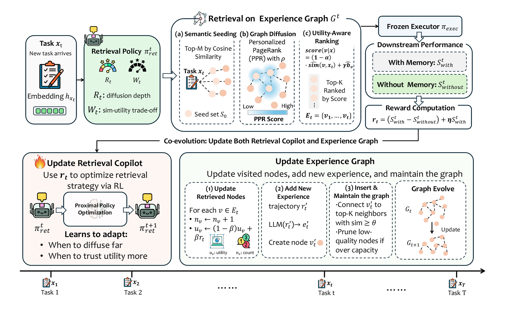

<h1 align="center">ExpHarness: Model-Agnostic Experience Learning through a Trainable Harness</h1>

<div align="center">
  <p>
    <a href="#-citation"></a>
    <a href="https://github.com/ulab-uiuc/ExpHarness/stargazers"></a>
    <a href="https://github.com/ulab-uiuc/ExpHarness/issues"></a>
    <a href="LICENSE"></a>
  </p>
</div>


## 🧩 Overview

LLM agents run inside a **harness**, the scaffolding that decides what enters the executor's context. However, the experience an agent accumulates across tasks rarely flows back into that harness. Fine-tuning the executor on collected experience ties the learning to one specific model, so it has to be redone whenever a stronger executor comes out.

**ExpHarness** is a learnable experience harness that improves **frozen and replaceable** LLM executors without touching their parameters. All learnable state lives in the harness $\mathcal{H} = (G, \pi_{\mathrm{ret}})$:

- **Self-evolving experience graph $G$.** Trajectories are distilled into reusable **skills** (from successes) and **lessons** (from failures). Each one is a node with an embedding, a utility estimate and a retrieval count, linked to semantically similar nodes.
- **Trainable retrieval copilot $\pi_{\mathrm{ret}}$.** A lightweight LM (Qwen2.5-3B-Instruct) reads the task and outputs two controls, $R$ and $W$:
  - $R$ sets *how broadly to explore the graph* (personalized-PageRank diffusion).
  - $W$ sets *how strongly to prefer historically useful experiences over merely similar ones* (UCB-utility vs. cosine ranking).
- **Utility-grounded reward.** The copilot is trained with PPO on

  $$r = \big(s_{\text{with}} - s_{\text{without}}\big) + \eta\, s_{\text{with}}$$

  i.e. the executor's gain from the retrieved experiences plus its absolute score. The same reward also updates node utilities in the graph, so the copilot and the graph co-evolve.

**Highlights**

- **Model-agnostic.** The executor (and the summarizer) is only an API call: Gemini, NVIDIA NIM, any OpenAI-compatible endpoint (e.g. a local vLLM server), or Claude.
- **Static and agentic tasks.** One framework covers 10 single-turn benchmarks (QA, math, code) and 2 multi-step environments (ALFWorld, AppWorld).
- **Ready-to-use data.** Processed train/val/test splits and the cold-start experience graphs are shipped in `data/`.
- **Scalable rollouts.** Parallel executor calls with multi-key round-robin, and AppWorld episodes served from isolated worker processes.

<div align="center">
  
</div>


## 📰 News

- 🚀 **[2026-10]**: ExpHarness code and data are released.


## 🔗 Links

- [Overview](#-overview)
- [Get Started](#-get-started)
- [Data](#-data)
- [Experiments](#-experiments)
- [Main Results](#-main-results)
- [Repository Structure](#-repository-structure)
- [Commonly Used Configs](#️-commonly-used-configs)
- [Extending ExpHarness](#-extending-expharness)
- [Citation](#-citation)


## 🚀 Get Started

### Installation

```bash
git clone https://github.com/ulab-uiuc/ExpHarness
cd ExpHarness

conda create -n expharness python=3.10 -y
conda activate expharness

# PyTorch + vLLM (versions used in our experiments)
pip install torch==2.4.0 --index-url https://download.pytorch.org/whl/cu121
pip install vllm==0.6.3
# Flash-Attention
pip install flash-attn --no-build-isolation
# Others
pip install -r requirements.txt
```

**ALFWorld.** Download the game files once (the default location is `~/.cache/alfworld`; set `ALFWORLD_DATA` to use another one):

```bash
alfworld-download
```

**AppWorld** (only needed for AppWorld experiments). AppWorld has its own dependencies, so we recommend a **separate** environment. The AppWorld episode servers run there and talk to the trainer over HTTP:

```bash
conda create -n appworld python=3.11 -y && conda activate appworld
pip install appworld requests openai
appworld install
appworld download data --root /path/to/appworld        # then: export APPWORLD_ROOT=/path/to/appworld
```

### Configure the frozen executor and the summarizer

The executor is selected with `AGENT_API` and the experience summarizer with `SUMMARIZER_API` (if unset, it falls back to the executor). API keys are read from environment variables only, and several keys can be comma-separated for round-robin:

| `AGENT_API` | Keys | Model | Notes |
|---|---|---|---|
| `gemini` | `GEMINI_API_KEYS` | `GEMINI_MODEL` | Google AI Studio |
| `nvidia` | `NVIDIA_API_KEYS` | `NVIDIA_MODEL` | [NVIDIA NIM](https://build.nvidia.com) |
| `openai` | `OPENAI_API_KEYS` | `OPENAI_MODEL` | any OpenAI-compatible server, set `OPENAI_BASE_URL` (e.g. vLLM) |
| `claude` | `ANTHROPIC_API_KEY` | `CLAUDE_MODEL` | Anthropic API |

The summarizer has its own `SUMMARIZER_MODEL`, `SUMMARIZER_BASE_URL` and `SUMMARIZER_API_KEYS`.

Every run script defaults to the paper setting of its task, so usually you only need to export the keys:

| Setting | Executor (default → alternative) | Summarizer |
|---|---|---|
| ExpSuite-Agentic | Gemini-3.1-Flash-Lite (`gemini`) → Qwen3-32B (`nvidia`) | Gemini-3.1-Flash-Lite |
| ExpSuite-Static | Llama-3.2-3B-Instruct (`nvidia`) → Llama-3.1-8B-Instruct | Qwen2.5-3B-Instruct, zero-shot (`openai`-compatible) |

```bash
# ExpSuite-Agentic
export GEMINI_API_KEYS="your-key-1,your-key-2"
#   small executor:  export AGENT_API=nvidia NVIDIA_MODEL=<NIM id of Qwen3-32B>

# ExpSuite-Static
export NVIDIA_API_KEYS="nvapi-xxx"
#   large executor:  export NVIDIA_MODEL=meta/llama-3.1-8b-instruct
vllm serve Qwen/Qwen2.5-3B-Instruct --port 8100 &      # summarizer (SUMMARIZER_BASE_URL)
```

Shared settings (copilot model, PPO hyper-parameters, graph-server device, W&B, ...) live in [`run/common.sh`](run/common.sh).


## 📊 Data

Everything needed for training and evaluation is under `data/` (~15 MB). Each task folder contains the copilot prompts (`*.parquet`) and a **cold-start experience graph** (`cold_start_graph.json`) built by running the frozen executor zero-shot on training tasks and summarizing the trajectories.

```
data/
├── alfworld/   train / val / val_seen (140) / val_unseen (134) .parquet, cold_start_graph.json
├── appworld/   train (90) / val (Test-N 168 + Test-C 417) .parquet, cold_start_graph.json
└── static/
    ├── all/        all 10 benchmarks              train / val / test .parquet, cold_start_graph.json
    ├── reasoning/  GSM8K, GSM-Symbolic, MATH      train / val / test .parquet, cold_start_graph.json
    └── coding/     HumanEval+, MBPP+              train / val / test .parquet, cold_start_graph.json
```

| Setting | Benchmarks | Metric |
|---|---|---|
| **ExpSuite-Static** | QA: ARC-C, CommonsenseQA, GPQA-Diamond, MMLU, OBQA · Reasoning: GSM8K, GSM-Symbolic, MATH · Coding: HumanEval+, MBPP+ | Accuracy / Exact Match / Pass@1 |
| **ExpSuite-Agentic** | ALFWorld (Seen / Unseen), AppWorld (Test-Normal / Test-Challenge) | Success / Pass Rate, #Steps ↓ |

> [!NOTE]
> ALFWorld game files are stored *relative* to `$ALFWORLD_DATA` (e.g. `json_2.1.1/valid_seen/...`) and resolved at runtime. To regenerate the ALFWorld training prompts, run `python scripts/data/prepare_alfworld.py --output_dir data/alfworld`.

**Cold start (optional).** The shipped graphs were built with the executors used in the paper. To rebuild them with your own executor:

```bash
bash run/alfworld/cold_start.sh
bash run/static/cold_start.sh all            # all | reasoning | coding
bash run/appworld/start_servers.sh && bash run/appworld/cold_start.sh
```


## 🧪 Experiments

Every run script starts the experience graph server automatically (`expharness/graph/experience_graph_server.py`, CPU by default), trains or evaluates the copilot with PPO, and stops the server on exit. GPUs are taken from `CUDA_VISIBLE_DEVICES`. Defaults are 4 GPUs for training and 2 for evaluation.

```
run/
├── common.sh                 shared settings (executor, copilot, PPO defaults, helpers)
├── alfworld/   train.sh  eval.sh  cold_start.sh
├── appworld/   start_servers.sh  train.sh  eval.sh  cold_start.sh
└── static/     train.sh  eval.sh  cold_start.sh       (domain: all | reasoning | coding)
```

### 🖥️ Training

```bash
# ALFWorld
bash run/alfworld/train.sh                      # [seed]

# AppWorld (start the episode servers in the AppWorld env first)
APPWORLD_ROOT=/path/to/appworld APPWORLD_PYTHON=$(conda run -n appworld which python) \
    bash run/appworld/start_servers.sh
bash run/appworld/train.sh

# ExpSuite-Static
bash run/static/train.sh all                    # all | reasoning | coding
```

During training, checkpoints go to `checkpoints/<experiment>/`. Every 20 steps the trainer saves both the copilot (`actor/global_step_<N>`) and a snapshot of the evolved graph (`graph_step_<N>.json`).

### 🧭 Evaluation

Evaluation loads the copilot checkpoint and the matching graph snapshot. Retrieval is greedy and the graph is frozen. The executor is run **with** and **without** the retrieved experiences on every test task.

```bash
bash run/alfworld/eval.sh checkpoints/expharness_alfworld_42 300
bash run/appworld/eval.sh checkpoints/expharness_appworld_42 300
bash run/static/eval.sh   all checkpoints/expharness_static_all_42 500
```

Per-benchmark results (success rate / accuracy with and without experiences, and average #steps for agentic tasks) are printed as `[Eval]` lines and saved to `outputs/eval/<name>/eval_summary.json`.


## 📈 Main Results

**ExpSuite-Static** (accuracy / exact match / Pass@1, %):

| Executor | Method | ARC-C | CSQA | GPQA-D | MMLU | OBQA | GSM8K | GSM-Sym | MATH | HumanEval+ | MBPP+ | **W-Avg** |
|---|---|---|---|---|---|---|---|---|---|---|---|---|
| Llama-3.2-3B | No Memory | 51.56 | 54.44 | 18.33 | 42.89 | 54.22 | 69.56 | 60.44 | 37.56 | 43.59 | 38.75 | 51.88 |
| | **ExpHarness** | **74.00** | **63.11** | **26.67** | **60.00** | **74.00** | **84.89** | **82.00** | **57.11** | **56.41** | **62.50** | **69.57** |
| Llama-3.1-8B | No Memory | 70.22 | 63.11 | 23.33 | 53.11 | 69.78 | 70.89 | 62.67 | 39.78 | 43.59 | 58.75 | 60.41 |
| | **ExpHarness** | **86.00** | **75.11** | **28.33** | **68.89** | **86.00** | **95.11** | **90.00** | **58.00** | **66.67** | **78.75** | **78.76** |

**ExpSuite-Agentic** (SR / PR in %, #Steps ↓):

| Executor | Method | ALF-Seen SR | #Steps | ALF-Unseen SR | #Steps | Test-N PR | #Steps | Test-C PR | #Steps | **Avg** | #Steps |
|---|---|---|---|---|---|---|---|---|---|---|---|
| Qwen3-32B | No Memory | 19.3 | 41.2 | 35.8 | 42.5 | 30.1 | 30.8 | 21.6 | 31.5 | 25.1 | 34.7 |
| | **ExpHarness** | **70.0** | **20.0** | **75.4** | **18.0** | **57.1** | **8.8** | **39.3** | **13.6** | **53.4** | **14.4** |
| Gemini-3.1-Flash-Lite | No Memory | 62.7 | 27.9 | 64.9 | 26.3 | 34.2 | 33.0 | 23.2 | 36.6 | 38.3 | 32.9 |
| | **ExpHarness** | **85.0** | **17.6** | **88.1** | **17.0** | **57.1** | **12.8** | **48.4** | **14.8** | **62.3** | **15.2** |

See the paper for the full comparison against retrieval-centric (ReasoningBank, ExpeL, LightMem, Mem0, AWM, MemRL), LLM-centric (IRCoT, Search-o1, S3) and prompt-based agentic (ReAct, Reflexion) baselines, plus the transfer experiments.


## 📁 Repository Structure

```
ExpHarness/
├── expharness/
│   ├── graph/experience_graph_server.py   # experience graph: seeding → PPR diffusion → UCB/cosine ranking,
│   │                                      #   EMA utility updates, dedup insertion, capacity pruning (FastAPI)
│   ├── copilot/generation.py              # copilot rollout: parse <search>R:W</search>, query the graph
│   ├── envs/
│   │   ├── alfworld_agent.py              # frozen executor in ALFWorld (TextWorld), parallel episodes
│   │   ├── alfworld_prompts.py            # copilot prompt template for ALFWorld
│   │   └── static_agent.py                # frozen executor for QA / math / code
│   ├── rewards/
│   │   ├── utility_reward.py              # r = (s_with - s_without) + s_with
│   │   └── static_reward.py               # answer checkers (math / multiple choice / code execution)
│   └── utils/llm_api.py                   # executor / summarizer backends: gemini | nvidia | openai | claude
├── verl/
│   └── trainer/main_expharness.py         # PPO entry point + reward manager + online graph updater
├── scripts/
│   ├── cold_start/                        # build the initial experience graphs
│   ├── data/prepare_alfworld.py           # regenerate ALFWorld copilot prompts
│   └── servers/appworld_server.py         # AppWorld episode server (separate env)
├── run/                                   # train / eval / cold-start scripts per task
├── data/                                  # processed splits + cold-start graphs
└── assets/
```


## ⚙️ Commonly Used Configs

**Environment variables** (see `run/common.sh`)
- `AGENT_API`, `*_API_KEYS`, `*_MODEL`: frozen executor backend (see [above](#configure-the-frozen-executor)).
- `BASE_MODEL`: retrieval copilot initialization (default `Qwen/Qwen2.5-3B-Instruct`).
- `CUDA_VISIBLE_DEVICES`: GPUs for copilot training/evaluation (`trainer.n_gpus_per_node` follows it).
- `GRAPH_DEVICE` (`cpu` | `cuda`), `GRAPH_GPU`, `GRAPH_PORT`, `GRAPH_INIT`: experience graph server.
- `ALFWORLD_NUM_WORKERS`, `QA_NUM_WORKERS`: number of parallel executor episodes / calls.
- `APPWORLD_ROOT`, `APPWORLD_PYTHON`, `APPWORLD_SERVER_URL`: AppWorld episode servers.

**Hyper-parameters** (paper, Appendix "Implementation Details"; set in `run/common.sh` and the graph server)

| Component | Setting |
|---|---|
| Copilot | Qwen2.5-3B-Instruct, PPO via verl + FSDP, reward weight η = 1 |
| Optimizer | AdamW, actor lr 5e-6, critic lr 1e-5, cosine decay, no warmup, KL coef 0.01 |
| Lengths | max prompt 4096, max response 500 tokens |
| Decoding | temperature 1.0 (training), greedy (evaluation) |
| Schedule | batch 16, up to 500 steps over 2 epochs, checkpoint every 20 steps, validation every 30 steps |
| Experience graph | Contriever, K_nn = 5, θ = 0.3, \|V\|_max = 2000, seeds m = 10, top-K = 10, UCB c = 1.0, EMA β = 0.1 |
| Infrastructure | 4 GPUs, vLLM (TP 1, memory 0.3), graph server on CPU |

**Hydra overrides** (in `run/<task>/*.sh`)
- `retriever.topk`: number of experiences given to the executor (top-K = 10).
- `+graph_update.enable`: online graph evolution (new experiences + utility updates); disabled at evaluation.
- `+graph_update.max_per_batch`: max new experiences summarized per training batch.
- `+env.name`, `+env.max_steps`: environment and episode horizon.
- `data.train_batch_size`, `trainer.total_training_steps`, `trainer.save_freq`, `trainer.test_freq`: PPO schedule.
- `actor_rollout_ref.actor.optim.lr` (5e-6), `critic.optim.lr` (1e-5), `algorithm.kl_ctrl.kl_coef` (0.01): PPO hyper-parameters.

**Experience graph server** (`expharness/graph/experience_graph_server.py`)
- `--max_nodes`: graph capacity |V|_max (2000); low-UCB nodes are pruned when it is exceeded.
- `ExperienceGraph.NUM_SEEDS` / `UCB_C` / `EMA_BETA`: m = 10, c = 1.0, β = 0.1.
- `--k_neighbors`, `--sim_threshold`: kNN edges are added only above the cosine threshold.


## 🔧 Extending ExpHarness

ExpHarness only needs **(i)** a way to run the frozen executor on a task with/without experiences and **(ii)** a score. To add a new task:

1. **Executor**: implement an episode function that takes `(task, experiences)` and returns a score and a trajectory, like `expharness/envs/static_agent.py` (single turn) or `expharness/envs/alfworld_agent.py` (multi-turn).
2. **Reward**: add a `_compute_<task>_rewards` branch in `ExpHarnessRewardManager` (`verl/trainer/main_expharness.py`), dispatched on the parquet `data_source`. The utility-grounded reward and graph updates can be reused as is.
3. **Summarizer**: add a trajectory → skill/lesson prompt in `ExperienceGraphUpdater`.
4. **Data**: write a parquet with the copilot prompt (`<search>R:W</search>` format, see `expharness/envs/alfworld_prompts.py`), `data_source` and `reward_model.ground_truth`, then build a cold-start graph.


## 🙏 Acknowledgments

ExpHarness is built on top of [verl](https://github.com/volcengine/verl) and borrows its copilot-training scaffolding from [s3](https://github.com/pat-jj/s3) and [Search-R1](https://github.com/PeterGriffinJin/Search-R1). We thank the authors of [ALFWorld](https://github.com/alfworld/alfworld), [AppWorld](https://github.com/StonyBrookNLP/appworld), [EvalPlus](https://github.com/evalplus/evalplus), and all the QA and math benchmarks used in ExpSuite for releasing their data and tools, and [Contriever](https://github.com/facebookresearch/contriever) for the retrieval encoder.


## 📚 Citation

```bibtex
@article{feng2026expharness,
  title={ExpHarness: Model-Agnostic Experience Learning through a Trainable Harness},
  author={Feng, Tao and Ye, Chongrui and Yu, Fangxu and Luo, Tianyang and Xu, Jingjun and Xu, Xueqiang and Zhang, Haozhen and Zhang, Weizhi and Lei, Zijie and Hua, Zhigang and Xie, Yan and Yang, Shuang and You, Jiaxuan},
  year={2026}
}
```
